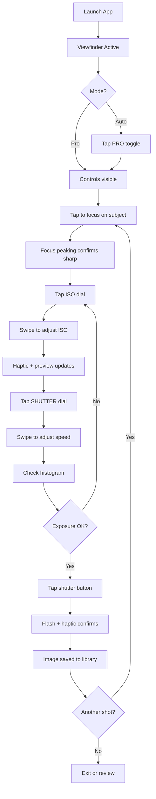
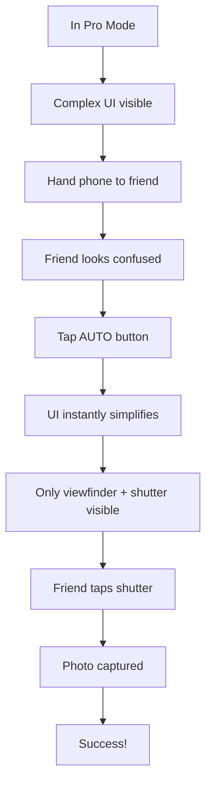
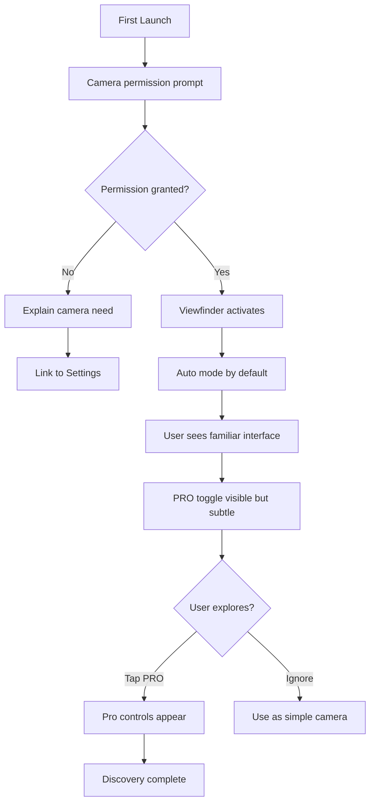

# UX Design Specification Camera

**Author:** Sixblack
**Date:** 2026-01-07

---

## Executive Summary

### Project Vision

Camera is a pro-grade mobile camera application that rivals the native iPhone camera in feature set while distinguishing itself through professional-grade manual controls. The core value proposition is the seamless toggle between intelligent auto-mode (comparable to the default app) and a fully manual mode where users dictate shot parameters. It fills the gap for photography enthusiasts who want DSLR-level control combined with iPhone's computational prowess.

### Target Users

**Primary:** Photography enthusiasts and power users who appreciate iPhone camera quality but feel limited by automatic decision-making. They want creative control—the ability to intentionally underexpose for drama, lock focus on a specific plane, or set exact white balance for consistency.

**Persona - Elena:** A street photographer who needs to control exposure, focus, and aperture simulation for artistic intent. She shoots in challenging mixed-lighting conditions and wants to capture the mood she sees, not the "safe" exposure the algorithm chooses.

**Secondary Consideration:** "Hand-off" users—people Elena might pass her phone to for a group shot. They need an instantly recognizable, simple interface.

### Key Design Challenges

1. **Complexity vs. Accessibility** - Expose professional controls without overwhelming users
2. **Mode Transition Clarity** - Auto ↔ Pro toggle must be unmistakable and seamless
3. **One-Handed Operation** - Thumb-reachable controls in portrait and landscape
4. **Information Density** - Balance visual aids against viewfinder prominence
5. **Speed Under Pressure** - Settings adjustable in <2 seconds without menu hunting

### Design Opportunities

1. **Progressive Disclosure** - Clean viewfinder in Auto; full cockpit in Pro mode
2. **Gestural Controls** - Swipe-based dials with haptics for tactile, fast adjustments
3. **Visual Confidence** - Focus peaking and histogram as competitive differentiators

## Core User Experience

### Defining Experience

The core experience of Camera centers on **the dial interaction**—swipe-based manual controls for ISO, Shutter Speed, Focus, and White Balance. This is the signature interaction that differentiates Camera from the native app. When a user swipes a dial and feels the haptic feedback while watching the preview respond in real-time, they experience the "aha" moment: professional control in their pocket.

**Core User Action:** Capture a photo with intentional, manually-controlled settings.

**Critical Interaction:** The manual control dials must feel physical and precise—like turning a real camera dial—with immediate visual feedback and tactile haptic "clicks."

### Platform Strategy

- **Platform:** Native iOS application (iPhone only)
- **Framework:** Swift/SwiftUI + AVFoundation/Metal for maximum performance
- **Input:** Touch-first with gesture-based controls
- **Connectivity:** 100% offline functionality, no account required
- **Device Capabilities:** Haptic Engine for dial feedback, ProRAW support, multi-lens switching, thermal monitoring

### Effortless Interactions

| Interaction | Expected Behavior |
|-------------|-------------------|
| Manual Dials | Swipe gestures feel like physical wheels—responsive, precise, haptic clicks |
| Mode Toggle | One tap to flip Auto ↔ Pro—instant, no confirmation |
| Capture | Shutter always thumb-reachable, zero delay tap-to-capture |
| Focus | Tap anywhere on viewfinder to set focus point |
| Lens Switch | Single tap to cycle through available lenses |

### Critical Success Moments

1. **"This is better" moment:** User swipes exposure dial, preview darkens in real-time with haptic feedback—instant confirmation of control
2. **First-time success:** New user opens app, sees familiar viewfinder, taps Pro, immediately grasps dial system without tutorial
3. **Make-or-break flow:** Adjust settings → Capture → Review shows shot matches preview exactly

### Experience Principles

1. **Dials Are King** - The swipe-dial interaction defines the product; it must feel physical and precise
2. **Instant Feedback** - Every adjustment shows immediately in the preview; no lag, no guessing
3. **One-Tap Escapes** - Auto mode is always one tap away; complexity never traps users
4. **Trust the Preview** - What you see is what you capture; the viewfinder is truth

## Desired Emotional Response

### Primary Emotional Goals

**Core Emotion:** Empowered and in control—users should feel like professional photographers, not phone users. The app transforms their device into a precision instrument that responds to their creative intent.

**Supporting Emotions:**
- **Creative Satisfaction** - "I finally got the shot I wanted"
- **Confident Mastery** - Knowing they captured exactly what they intended
- **Mastery Without Complexity** - Power that doesn't feel intimidating

### Emotional Journey Mapping

| Stage | Desired Emotion |
|-------|-----------------|
| First Launch | Familiar yet intrigued—"This looks like my camera, but there's more here" |
| Discovering Pro Mode | Curious confidence—"I can handle this" |
| Adjusting Dials | Empowered mastery—"I'm in control of this shot" |
| Capture Moment | Satisfying certainty—"I got it" |
| Reviewing the Shot | Pride and validation—"Exactly what I intended" |
| Something Goes Wrong | Calm, not panic—"I can fix this with one tap" |
| Returning to App | Eager anticipation—"What will I capture today?" |

### Micro-Emotions

**Emotions to Cultivate:**
- **Confidence over Confusion** - Controls feel learnable, not overwhelming
- **Trust over Skepticism** - Preview matches the final capture
- **Accomplishment over Frustration** - Adjustments feel intentional, not accidental
- **Delight in the Details** - Haptics and smooth animations create subtle joy

**Emotions to Avoid:**
- **Overwhelmed** - Too many controls visible at once
- **Trapped** - Unable to return to "safe" auto mode
- **Betrayed** - Preview differs from captured result
- **Rushed** - App feels slow or unresponsive under pressure

### Design Implications

| Emotion | UX Design Approach |
|---------|-------------------|
| Empowered | Dials respond instantly; user sees direct cause-and-effect |
| Confident | Focus peaking + histogram confirm "safe" shot before capture |
| Mastery | Haptic "clicks" on dials feel like real camera equipment |
| Calm (in panic) | Auto button always visible, one-tap escape |
| Trust | WYSIWYG viewfinder—preview equals final result |

### Emotional Design Principles

1. **Responsiveness Builds Empowerment** - Zero lag between input and visual feedback
2. **Visibility Creates Confidence** - Show exposure data, focus confirmation, histogram
3. **Escape Routes Prevent Panic** - Auto mode always one tap away
4. **Tactile Feedback Signals Mastery** - Haptics make digital controls feel physical
5. **Consistency Earns Trust** - What you see is exactly what you capture

## UX Pattern Analysis & Inspiration

### Inspiring Products Analysis

**Native iPhone Camera**

The benchmark for speed and accessibility. Key UX strengths:
- **Instant Launch** - Camera ready in <1 second, even from lock screen
- **Zero Learning Curve** - Shutter button, viewfinder, done—anyone can use it
- **Thumb-First Design** - All critical controls reachable with one hand
- **Mode Switching** - Horizontal swipe between Photo/Video/Portrait
- **Tap-to-Focus** - Intuitive, immediate, with subtle exposure slider
- **Minimal Chrome** - Viewfinder dominates; controls fade when not needed

**Halide**

The gold standard for pro controls with elegant UI. Key UX strengths:
- **Gesture-Based Dials** - Swipe anywhere to adjust exposure—feels tactile
- **Focus Peaking** - Highlights sharp edges in vivid color overlay
- **Pro Data Display** - Histogram, ISO, shutter shown without clutter
- **RAW-First** - One-tap RAW toggle, clear format indicator
- **Depth Mode** - Manual focus with depth visualization
- **Dark UI** - Interface recedes, image is hero

### Transferable UX Patterns

| Pattern | Source | Application to Camera |
|---------|--------|----------------------|
| Swipe-anywhere dials | Halide | Core dial interaction for ISO/Shutter/Focus |
| Horizontal mode swipe | Native | Auto ↔ Pro mode switching gesture |
| Tap-to-focus with exposure slider | Native | Familiar focus interaction |
| Focus peaking overlay | Halide | Visual confirmation of sharpness |
| Minimal chrome / dark UI | Halide | Let the viewfinder be the hero |
| Instant launch priority | Native | Architecture must prioritize <1.5s launch |
| Thumb-zone design | Native | All controls in lower third of screen |

### Anti-Patterns to Avoid

- **Buried Settings** - Never hide critical controls in menus; pro controls must be surface-level
- **Modal Dialogs** - Never interrupt shooting flow with confirmations or alerts
- **Tutorial Overlays** - Avoid blocking the viewfinder with onboarding content
- **Cluttered HUD** - Don't show all data at once; use progressive disclosure
- **Slow Initialization** - Never sacrifice launch speed for feature loading

### Design Inspiration Strategy

**What to Adopt:**
- Halide's swipe-dial interaction as our core manual control paradigm
- Native Camera's tap-to-focus with exposure slider for familiar focus behavior
- Halide's dark, minimal UI that lets the viewfinder dominate
- Native Camera's thumb-zone placement for one-handed operation

**What to Adapt:**
- Native Camera's horizontal swipe for modes → adapt for Auto/Pro toggle
- Halide's focus peaking → ensure toggle is easily discoverable for new users

**What to Avoid:**
- Complex settings hierarchies that hide pro controls
- Any interaction that blocks or delays the capture moment
- Onboarding that requires dismissing overlays before shooting

## Design System Foundation

### Design System Choice

**HIG Foundation + Pro Photography Aesthetic**

Camera will use Apple's Human Interface Guidelines as the foundation, layered with a custom dark-mode pro photography aesthetic. This hybrid approach provides native iOS familiarity while delivering the professional, tool-like feel that differentiates pro camera apps.

### Rationale for Selection

1. **Familiarity Breeds Trust** - Native iOS patterns (gestures, navigation, system controls) reduce learning curve and feel "right" to iPhone users
2. **Dark UI for Photography** - Professional photography apps use dark themes so the UI recedes and the image becomes the hero
3. **Custom Where It Matters** - Design investment focused on differentiating elements: swipe dials, focus peaking, histogram, exposure display
4. **SwiftUI Alignment** - HIG integrates naturally with SwiftUI, enabling faster development with native performance
5. **Accessibility Built-In** - Apple's accessibility features (Dynamic Type, VoiceOver) come free with HIG compliance

### Implementation Approach

| Layer | Approach |
|-------|----------|
| **Foundation** | Apple HIG patterns, SF Symbols, system haptics |
| **Theme** | Dark mode only, high contrast for outdoor visibility |
| **Typography** | SF Pro with customized weights for data display |
| **Controls** | Native iOS controls for settings; custom for shooting controls |
| **Color** | Minimal accent color; let the viewfinder image provide color |

### Customization Strategy

**Native Components (Use As-Is):**
- Navigation patterns
- Settings screens and toggles
- Permission dialogs
- Photo library integration

**Custom Components (Design from Scratch):**
- Swipe dial controls for ISO/Shutter/Focus/WB
- Histogram overlay
- Focus peaking visualization
- Exposure value display (ISO, shutter speed, aperture)
- Mode toggle (Auto/Pro)
- Shutter button with capture feedback

**Design Tokens:**
- Background: True black (#000000) for OLED efficiency
- Text: High-contrast white/gray for outdoor readability
- Accent: Single accent color for interactive elements
- Data: Monospace numerals for exposure values

## Defining Experience

### The Core Interaction

**"Swipe the dial, see it change, capture with confidence"**

The defining experience of Camera is the moment a user swipes to adjust exposure, watches the preview respond in real-time with haptic feedback, and captures exactly what they intended. This is the interaction users will describe to friends and the reason they choose Camera over alternatives.

### User Mental Model

**Expectations users bring:**
- **From DSLR/Mirrorless cameras:** Physical dials that click, WYSIWYG viewfinders, direct control
- **From Native iPhone Camera:** Tap-to-focus, instant capture, reliable results
- **From Halide/ProCamera:** Gesture-based manual controls on mobile

**What they love:** Direct cause-and-effect control, immediate visual feedback, predictable results
**What they hate:** Input lag, unpredictable results, settings buried in menus, captures that don't match preview

### Success Criteria

| Criteria | Target |
|----------|--------|
| Dial response latency | <16ms (60 FPS) |
| Preview-to-capture fidelity | 100% match |
| Time to adjust any setting | <2 seconds |
| Haptic feedback | On every dial "click" |
| Mode switch time | <500ms |
| Launch to capture-ready | <1.5 seconds |

### Pattern Analysis

| Pattern Type | Implementation |
|--------------|----------------|
| **Established** | Tap-to-focus (from native Camera) |
| **Established** | Swipe for mode switching (from native Camera) |
| **Adapted** | Swipe-dial controls (from Halide, refined) |
| **Novel Combination** | Haptic clicks synced with dial values + real-time preview |

**Assessment:** Primarily established patterns combined in a polished way—no user education required. Users familiar with native Camera or Halide will feel instantly at home.

### Experience Mechanics

**The Dial Interaction Flow:**

**1. Initiation**
- User enters Pro mode via visible toggle (always accessible)
- Dial controls appear at bottom of screen (thumb zone)
- Current values displayed: ISO 100 | 1/250s | f/1.8

**2. Interaction**
- User places thumb on dial area (ISO, Shutter, Focus, or WB)
- Swipes up/down to adjust value
- Each "stop" triggers haptic tick
- Preview updates in real-time (<16ms latency)
- Value label updates with current setting

**3. Feedback**
- **Visual:** Preview brightness/exposure changes immediately
- **Haptic:** Subtle tick on each value increment
- **Audio:** Optional soft click (user preference)
- **Confirmation:** Histogram shifts to reflect exposure change

**4. Completion**
- User lifts thumb—value locks in place
- Settings persist until manually changed
- User taps shutter to capture
- Brief flash animation confirms capture
- Image saved matches preview exactly

## Visual Design Foundation

### Color System

| Role | Color | Hex | Usage |
|------|-------|-----|-------|
| **Background** | True Black | `#000000` | Viewfinder, main UI (OLED-efficient) |
| **Surface** | Dark Gray | `#1C1C1E` | Cards, controls, overlays |
| **Text Primary** | White | `#FFFFFF` | Labels, values, critical info |
| **Text Secondary** | Medium Gray | `#8E8E93` | Hints, inactive states |
| **Accent** | Signal Orange | `#FF9500` | Interactive elements, focus indicators |
| **Success** | Green | `#30D158` | Confirmation, in-focus indicator |
| **Warning** | Yellow | `#FFD60A` | Exposure warnings, histogram clipping |
| **Error** | Red | `#FF453A` | Errors, overexposure alerts |

**Color Rationale:**
- True black maximizes OLED battery life and makes viewfinder image "pop"
- Single accent color (orange) signals interactivity without competing with photo content
- Semantic colors (success/warning/error) provide instant feedback on exposure safety

### Typography System

| Element | Font | Weight | Size |
|---------|------|--------|------|
| **Exposure Values** | SF Mono | Medium | 17pt |
| **Control Labels** | SF Pro | Semibold | 13pt |
| **Mode Indicator** | SF Pro | Bold | 15pt |
| **Settings Headers** | SF Pro | Bold | 17pt |
| **Body Text** | SF Pro | Regular | 15pt |

**Typography Rationale:**
- Monospace for exposure data ensures alignment and precision feel
- SF Pro for all other text maintains iOS native feel
- Clear hierarchy distinguishes data from labels

### Spacing & Layout Foundation

| Element | Value |
|---------|-------|
| **Base Unit** | 8pt |
| **Control Padding** | 16pt (2x base) |
| **Thumb Zone** | Bottom 180pt of screen |
| **Viewfinder Margin** | 0pt (edge-to-edge) |
| **Control Spacing** | 24pt between dial groups |
| **Safe Area Respect** | Yes (notch, home indicator) |

**Layout Principles:**
1. **Viewfinder First** - Image preview gets maximum screen real estate
2. **Thumb Zone Controls** - All shooting controls in lower third
3. **Progressive Reveal** - Pro controls appear on mode switch, not cluttering Auto mode
4. **Edge-to-Edge** - No margins on viewfinder; controls float on top

### Accessibility Considerations

- All text meets WCAG AA contrast ratio (4.5:1 minimum)
- Interactive elements meet 44x44pt minimum touch target
- VoiceOver labels for all controls
- Support for Bold Text and Larger Accessibility Sizes in settings screens
- High contrast mode: boost text to pure white, increase control borders

## Design Direction

### Design Directions Explored

Four design directions were evaluated for Camera's interface approach:

- **Direction A: Halide-Style Minimal** - Ultra-clean viewfinder, horizontal dial strip, controls fade when idle
- **Direction B: Pro Cockpit** - Information-rich with persistent data overlay, vertical dial stack
- **Direction C: Native Camera Evolution** - Familiar native layout with progressive complexity
- **Direction D: Split View** - Dedicated control panel separated from viewfinder

### Chosen Direction

**Direction A: Halide-Style Minimal**

A clean, viewfinder-first approach where the image is always the hero. Controls live in a horizontal dial strip at the bottom, fading to near-invisibility when not in use. This direction maximizes screen real estate for the photo preview while keeping professional controls accessible.

**Layout Structure:**
```
┌─────────────────────────────┐
│  [≡]              [HDR] [⚡] │  ← Top bar: settings, toggles
│                             │
│      VIEWFINDER             │
│      (edge-to-edge)         │
│                    [histogram]
│                             │
├─────────────────────────────┤
│  ISO │ SHUTTER │ FOCUS │ WB │  ← Dial selector row
│         ◀═══●═══▶           │  ← Active dial (swipe area)
│  [AUTO]    [ ◉ ]    [RAW]   │  ← Mode, shutter, format
└─────────────────────────────┘
```

**Key Characteristics:**

| Element | Behavior |
|---------|----------|
| **Viewfinder** | Edge-to-edge, no chrome until touched |
| **Controls** | Fade to 30% opacity after 3 seconds of inactivity |
| **Dial Strip** | Horizontal row; tap to select parameter, swipe to adjust |
| **Active Dial** | Expands slightly, shows value range, haptic on adjust |
| **Histogram** | Semi-transparent overlay, top-right, toggleable |
| **Shutter** | Large, centered, always fully visible |
| **Mode Toggle** | "AUTO" button bottom-left, one-tap escape |

### Design Rationale

1. **Viewfinder First** - Maximizes screen real estate for the photo preview; the image is always the star
2. **Halide Mental Model** - Users familiar with pro camera apps will feel immediately at home
3. **Progressive Disclosure** - Interface starts simple; complexity appears only when needed
4. **One-Handed Operation** - All controls positioned in thumb zone for portrait shooting
5. **Focus Through Subtraction** - Fading controls reduce visual noise; user focuses on composition

### Interaction States

| State | Behavior |
|-------|----------|
| **Idle** | Controls at 30% opacity, viewfinder dominates |
| **Active** | Touch in control zone → controls fade to 100% |
| **Adjusting** | Selected dial highlighted with accent color, value displayed large |
| **Capturing** | Brief flash animation, controls remain stable |

## User Journey Flows

### Journey 1: Manual Pro Capture

**Scenario:** User wants to capture a photo with intentional manual settings (Elena's Controlled Portrait)



**Key Interactions:**

| Step | Action | Feedback |
|------|--------|----------|
| Focus | Tap viewfinder | Focus peaking highlight, focus box |
| Select dial | Tap dial label | Dial expands, accent color |
| Adjust value | Swipe up/down | Haptic tick, preview updates, value changes |
| Capture | Tap shutter | Flash animation, haptic, save confirmation |

### Journey 2: Auto Mode Escape

**Scenario:** User needs to quickly simplify the interface for someone else (The "Hand-off" Panic)



**Key Interactions:**

| Step | Action | Feedback |
|------|--------|----------|
| Escape | Tap AUTO | Instant transition (<500ms), dials hide, clean UI |
| Capture | Tap shutter | Standard capture flow |

### Journey 3: First Launch & Permission Flow

**Scenario:** New user opens app for the first time



### Journey Patterns

**Navigation Patterns:**
- **Mode Toggle:** Single tap switches between Auto and Pro instantly
- **Dial Selection:** Tap to select, swipe to adjust (no mode required)
- **Focus Control:** Tap anywhere on viewfinder to set focus point

**Feedback Patterns:**
- **Haptic Confirmation:** Every value change, every capture
- **Visual Confirmation:** Focus peaking, histogram shift, flash on capture
- **State Indication:** Active dial highlighted with accent color

**Error Recovery Patterns:**
- **Permission Denied:** Clear explanation + deep link to Settings
- **Overexposure Warning:** Histogram shows clipping in yellow/red
- **One-Tap Reset:** AUTO button resets all manual settings

### Flow Optimization Principles

1. **Minimum Taps to Capture:** Pro mode capture possible in 3 taps (focus, adjust, shutter)
2. **No Dead Ends:** Every state has a clear next action or escape route
3. **Preserve Intent:** Manual settings persist until explicitly changed
4. **Graceful Degradation:** Auto mode always available as fallback
5. **Zero Onboarding:** Interface discoverable without tutorials

## UX Consistency Patterns

### Button Hierarchy

**Primary Actions (Always prominent):**
- **Shutter** is the primary action; centered, largest hit target, always visible.
- **AUTO/PRO toggle** is the primary escape action; always reachable in thumb zone.

**Secondary Actions (Contextual, but visible):**
- **Lens switch, RAW toggle, HDR/Flash** appear in top bar or adjacent cluster.
- Secondary buttons are smaller, lower contrast, and never compete with shutter.

**Tertiary Actions (Hidden or low-priority):**
- Settings and advanced tools live behind a single icon (e.g., gear or menu) and should not block capture flow.

**When to Use:**
- Primary: actions that enable or trigger capture.
- Secondary: actions that adjust the shot or mode.
- Tertiary: infrequent configuration.

**Visual Design:**
- Primary buttons: high-contrast fill, accent color or white ring on black.
- Secondary buttons: outlined or ghost style, lower contrast.
- Tertiary buttons: icon-only, muted.

**Behavior:**
- Primary actions never move or disappear.
- Secondary actions can fade to 30% opacity in idle state but remain tappable.

**Accessibility:**
- Minimum 44x44pt touch targets.
- High-contrast state for outdoor visibility.
- VoiceOver labels for all controls (“Shutter button”, “Switch to Pro”).

**Mobile Considerations:**
- Thumb-zone placement for primary/secondary actions.
- Avoid top-right-only critical actions for one-handed use.

**Variants:**
- Active state: accent highlight and haptic tick.
- Disabled state: 40% opacity with clear label if disabled.

### Feedback Patterns

**Capture Feedback (Success):**
- Subtle flash animation on capture.
- Haptic confirmation on shutter press.
- Optional tone (user preference).

**Adjustment Feedback (Info):**
- Dial changes show immediate preview response.
- Haptic tick per value step.
- Histogram and focus peaking update live.

**Warning Feedback (Caution):**
- Exposure clipping indicated in yellow/red in histogram.
- Over/under exposure warning icon appears near exposure values.

**Error Feedback (Critical):**
- Permission denied: inline message with “Open Settings” button.
- Capture failure: non-blocking toast with retry suggestion.

**When to Use:**
- Success: completed capture or setting applied.
- Info: continuous adjustments.
- Warning: exposure risk or thermal throttling.
- Error: permissions or capture failure.

**Visual Design:**
- Success: green indicator or subtle check.
- Warning: yellow/orange (aligned with system palette).
- Error: red with clear iconography.

**Behavior:**
- Feedback must never block capture flow.
- Errors should not dismiss the viewfinder.

**Accessibility:**
- Haptics paired with visual feedback.
- Color-coded warnings also include icons/text.

**Mobile Considerations:**
- Toasts appear above bottom controls to avoid occluding shutter.
- Use short, glanceable feedback.

### Additional Patterns

**None defined in this step.**

## Responsive Design & Accessibility

### Responsive Strategy

- **Platform Scope:** iPhone-first UI, scaled up for iPad (no separate tablet layout).
- **Orientation:** Portrait-only UI; viewfinder remains sensor-aligned.
- **Layout Behavior:** Core controls remain in the thumb zone; spacing scales up on larger devices.
- **iPad Treatment:** Same control hierarchy and interaction model as iPhone, with increased padding and larger tap targets.

### Breakpoint Strategy

- **Device-Class Breakpoints:** Use device classes rather than generic web breakpoints.
  - iPhone mini / SE class
  - iPhone standard / Pro
  - iPhone Max / Plus
  - iPad (scaled iPhone UI)
- **Mobile-First:** All layouts originate from iPhone; iPad inherits scaled layout without additional panels.

### Accessibility Strategy

- **Target Level:** WCAG AA.
- **Contrast:** Maintain 4.5:1 for text and 3:1 for large labels.
- **Touch Targets:** Minimum 44x44pt across all controls.
- **Screen Readers:** Full VoiceOver labeling for all controls, including camera state and exposure values.
- **Focus & Feedback:** Clear focus states, haptic feedback paired with visual cues.
- **Reduced Motion:** Respect system Reduce Motion for animations.

### Testing Strategy

- **Device Testing:** iPhone SE/mini, standard, Max/Plus, and iPad.
- **Accessibility Testing:** VoiceOver, Larger Text, High Contrast, and Reduce Motion.
- **Visual Checks:** Contrast checks for all UI overlays on dark backgrounds.
- **Interaction Testing:** One-handed reachability and portrait-only constraints.

### Implementation Guidelines

- **Responsive Development:**
  - Use scalable layout constants (spacing/padding) by device class.
  - Keep controls anchored to bottom thumb zone in portrait.
- **Accessibility Development:**
  - Provide VoiceOver labels and hints for all controls and states.
  - Use SF Symbols with accessible labels.
  - Avoid relying on color alone for warnings.

