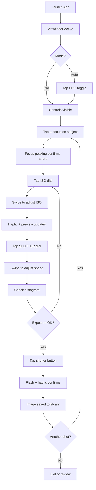
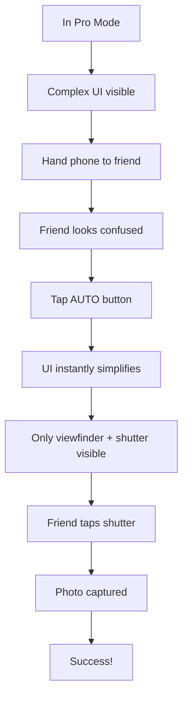
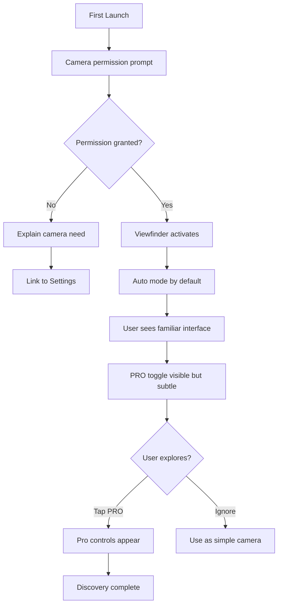

# User Journey Flows

## Journey 1: Manual Pro Capture

**Scenario:** User wants to capture a photo with intentional manual settings (Elena's Controlled Portrait)

**Key Interactions:**

| Step | Action | Feedback |
|------|--------|----------|
| Focus | Tap viewfinder | Focus peaking highlight, focus box |
| Select dial | Tap dial label | Dial expands, accent color |
| Adjust value | Swipe up/down | Haptic tick, preview updates, value changes |
| Capture | Tap shutter | Flash animation, haptic, save confirmation |

## Journey 2: Auto Mode Escape

**Scenario:** User needs to quickly simplify the interface for someone else (The "Hand-off" Panic)

**Key Interactions:**

| Step | Action | Feedback |
|------|--------|----------|
| Escape | Tap AUTO | Instant transition (<500ms), dials hide, clean UI |
| Capture | Tap shutter | Standard capture flow |

## Journey 3: First Launch & Permission Flow

**Scenario:** New user opens app for the first time

## Journey Patterns

**Navigation Patterns:**
- **Mode Toggle:** Single tap switches between Auto and Pro instantly
- **Dial Selection:** Tap to select, swipe to adjust (no mode required)
- **Focus Control:** Tap anywhere on viewfinder to set focus point

**Feedback Patterns:**
- **Haptic Confirmation:** Every value change, every capture
- **Visual Confirmation:** Focus peaking, histogram shift, flash on capture
- **State Indication:** Active dial highlighted with accent color

**Error Recovery Patterns:**
- **Permission Denied:** Clear explanation + deep link to Settings
- **Overexposure Warning:** Histogram shows clipping in yellow/red
- **One-Tap Reset:** AUTO button resets all manual settings

## Flow Optimization Principles

1. **Minimum Taps to Capture:** Pro mode capture possible in 3 taps (focus, adjust, shutter)
2. **No Dead Ends:** Every state has a clear next action or escape route
3. **Preserve Intent:** Manual settings persist until explicitly changed
4. **Graceful Degradation:** Auto mode always available as fallback
5. **Zero Onboarding:** Interface discoverable without tutorials
